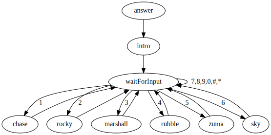

# toddlers-first-asterisk

A simple asterisk configuration with a single digit dialplans for a toddler to
learn how to use an analogue phone.

Watch a demo of the phone on youtube:

<p align="center">
    <a href="https://www.youtube.com/watch?v=TPnLgXA_lZ4"
       target="_blank">
        <br>
        https://www.youtube.com/watch?v=TPnLgXA_lZ4
    </a>
</p>


# Building and deploying

Build with:
```
$ sudo build.sh
```

The build script builds, configures, and starts asterisk.

This asterisk deployment is meant to run in an lxd container.

# Dialplan

When the phone is picked up, the PAP2 will dial the number `1`.  The dialplan
will answer when any number is dialed. The Paw Patrol input is played, then
the dial plan goes into an infinite loop: it waits for input.  If the input is
in 1 through 6 (inclusive), a pup catch phrase is played, then it goes back to
waiting for input.  If the input is unexpected, then go back to the waiting for
input state.

<p align="center">
    
</p>


# PAP2 Configuration

To configure a Linksys PAP2 to connect to Asterisk:

| Configuration Page | Key       | Value              | Source of value in Asterisk |
| -                  | -         | -                  | -                           |
| Line 1             | SIP Port  | 5060               | (Default value)             |
|                    | User ID   | 6001               | `/etc/asterisk/pjsip.conf`: Group name and `6001.username=6001 |
|                    | Password  | `unsecurepassword` | `/etc/asterisk/pjsip.conf`: `6001.password=unsecurepassword` |
|                    | Proxy     | `asterisk`         | The hostname of the machine running asterisk |
|                    | Dial Plan | `P0<:1>`           | Auto dials the extension `1` |


# Debugging Asterisk

Connect to the Asterisk console with
```
sudo asterisk -r
```


# `.wav` Files

Wave files must be mono and sampled at 8Hz.  The wav with a 16 bit sample width
sounds much better than a wave with an 8 bit sample width.  To take any wave
and convert it to mono and resample it, execute:
```
sox $INPUT --channels 1 --bits 16 --rate 8000 $OUTPUT
```

